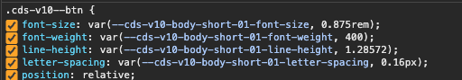
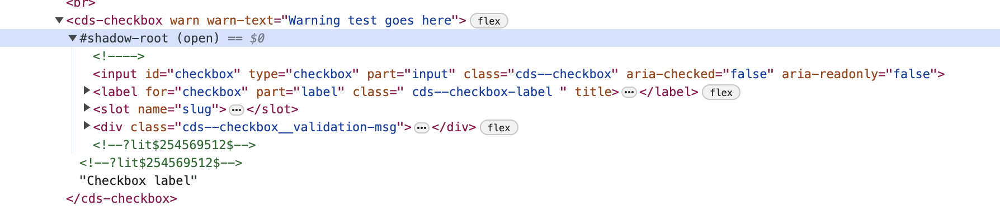

# Support for Carbon v10

Carbon for AI is built on the latest major version of Carbon, v11. The most
streamlined path for usage of Carbon for AI and related assets such as the
`Slug` from `@carbon/react` is to have your project using v11. If your project
is not on v11, we first and foremost recommend migrating to v11 as soon as
possible.

For projects using Carbon v10 that can not yet migrate to v11, this document
outlines some "bridge solutions" - approaches a project can use to include
Carbon for AI and Carbon v11 assets in a project still using Carbon v10.

<!-- prettier-ignore-start -->
> [!IMPORTANT]
> This guidance largely pertains to the consumption of AI features that are
> enhancements of existing components in `@carbon/react` and
> `@carbon/web-components`. AI patterns that do not exist in these core Carbon
> libraries will be available as packages from the `Carbon for AI` library. If
> your application is on Carbon v11 (regardless of front-end framework), you
> will be able to consume the `Carbon for AI` components and patterns via NPM or
> IBM Akamai CDN. However, if your application is on Carbon v10 (regardless of
> front-end framework), you will still be able to consume the `Carbon for AI`
> components via IBM Akamai CDN.

> [!CAUTION]
> The bridge solutions outlined in this document are only meant to be a
> temporary, stopgap measure to bring in selective, business critical features
> until your project can migrate to v11.
<!-- prettier-ignore-end -->

So far we have identified two broad approaches:

- Use Carbon v11 package assets in a v10 application (React teams only)
- Use assets from a CDN in a v10 application (regardless of front-end framework
  used)

## Use Carbon v11 `@carbon/react` assets in a v10 application

It is possible to run v10 and v11 together without any strenuous configuration.
Package managers and bundlers handle duplicate transitive dependencies with
different versions just fine, though you do have to be aware of what's happening
and the potential caveats you can run into.

> [!NOTE] >
> [Here is a stackblitz example](https://stackblitz.com/edit/github-pdxjpu?file=package.json,src%2FApp.jsx,src%2Findex.scss,src%2Fextra-slug-styles.scss&preset=node=)
> showing it is possible to use various components and styles from v10 and v11
> together, including the new `Slug`.
>
> The example will take a few moments to load because it uses live sass
> compilation, which takes a bit to complete with v10 styles.

At a high level the process for using these together was:

1. Install and configure Carbon v10 - `carbon-components@10.x`,
   `carbon-components-react@7.x`, `carbon-icons@7.x` (or have an existing
   application using these v10 packages)
2. Install `@carbon/react`
3. Configure the `@carbon/react` styles with `@use`
4. Import v11 components from `@carbon/react` and icons from
   `@carbon/react/icons`

### Caveats

The complications we've seen are some teams running into odd errors stemming
from an additional layer of sub/transitive dependencies. Often, projects use
additional library(ies) that proxy Carbon v10, like Cloud PAL. Sometimes the
libraries don't fully proxy carbon but they
[list carbon as hard dependencies](https://github.com/carbon-design-system/ibm-products/blob/7994c5c13da6b467f5ecea5487b2bb8ff20e15bd/packages/security/package.json#L57-L66).

> [!IMPORTANT] So far, **all the errors we've seen are only styling-based (sass)
> errors**. We haven't seen any javascript errors resulting from mixing v10 and
> v11. It commonly presents as Sass errors of "mixin not found", "... is not a
> number", etc. indicating the erroring stylesheet is looking for part of an API
> that can't be found in that version.

If a developer adds `@carbon/react` to their project, configures the styles, and
then sees an error, it's most likely due to the bundler using a v10 carbon
package/dependency when it should be using a v11 one. For instance,

1. A project is using Carbon v10 via `carbon-components@10.x` and
   `carbon-components-react@7.x`
2. A developer installs `@carbon/react` to the project.
3. Both `carbon-components-react@7.x` and `@carbon/react` list `@carbon/layout`
   as a dependency:

| `carbon-components-react@7.x`  | `@carbon/react@1.x`            |
| ------------------------------ | ------------------------------ |
| `"@carbon/layout": "^10.37.2"` | `"@carbon/layout": "^11.20.0"` |

If the developer brings in styles from `@carbon/layout`, which version is used,
v10 or v11? In our tests, it uses v10.

### Potential solutions

Approaches we've evaluated to get around this issue are:

1. Alias the package names
2. Isolate the styles

#### Option 1: Alias the package names

Any package can be aliased to a different name to prevent inadvertent conflicts.
For example:

```sh
npm install @carbon/layout-v11@npm:@carbon/layout@11
```

The goal with this approach is to avoid naming conflicts by either aliasing v10
packages, or the v11 packages. If you alias v10 package names, you'll have to
update all your existing imports. If you alias v11 packages, your existing
imports can stay the same, but new imports for v11 components will have to use
the alias. For these style-only errors, it may be easiest to install and alias
v11 packages.

The reason this works is because when the bundler goes to look for
`@carbon/layout` for instance, it will only use the non-aliased version. This
way you can then specify exactly when/where you want to bring in and use the
aliased version, `@carbon/layout-v11`.

#### Option 2: Isolate the styles

The goal with this approach is to totally separate the v10 and v11 styles into
separate stylesheets that are loaded independently via webpack.
[Here's an example](https://github.ibm.com/alchemy-containers/ui-dev/blob/master/lib/webpack/index.js)
from a cloud team using this approach.

The reason this works is that the imports/use statements are totally separate
from one another, which prevents the sass global namespace from being polluted
with invalid stylesheets from the other version. v10 styles import
`carbon-components` stylesheets and related sub-dependencies. v11 styles
`@use '@carbon/react` stylesheets and related sub-dependencies.

For bundlers other than webpack it may be more difficult to separate these into
isolated execution contexts.

### Impacts to bundle size

Bundle size will temporarily increase with these approaches. Most teams that
have taken this route are okay with paying this bundle-size "price" to
facilitate the migration. It's only temporary, and eventually they will be able
to remove the `carbon-components` styles and `carbon-components-react` js once
they're fully migrated to v11.

#### Impact to javascript bundle size

For javascript imports, treeshaking will still work as you'd expect to only
bring in the components you end up using. Icons are bucketed in both v10 and
v11, and if you import a `@carbon/react` component that uses an icon, a
collection of new icons in the same bucket will end up in your bundle.

##### Mitigation

You can reduce the likelihood of this by avoiding using `@carbon/react/icons`
until you migrate all your icon usages at once. We have a codemod available
through `@carbon/upgrade` to assist with
[this migration](https://carbondesignsystem.com/migrating/guide/develop#step-5:-update-icon-sizes-and-imports).

```
npx @carbon/upgrade migrate icons-react-size-prop --write
npx @carbon/upgrade migrate update-carbon-icons-react-import-to-carbon-react --write
```

#### Impact to style/css bundle size

Style bundle size is going to increase because you're including new styles for
v11. Most v10 projects are going to already be loading all the styles available
through `carbon-components`, then by adding `@carbon/react` styles it'll
probably nearly double in size of total final css output. These two packages use
different prefixes for all the selectors so there's no risk of conflicts, but
there's effectively quite a bit of duplication while you're running both
packages at the same time.

##### Mitigation

You can mitigate the scope of this increase by selectively `@import` or `@use`
only the styles you need.
[Here's an updated version of my initial example](https://stackblitz.com/edit/github-pdxjpu-15f9fc?file=src%2Findex.scss&preset=node=)
that only brings in the individual style modules required for the components on
the page: `Button`, `Accordion`, `Slug` (and therefore `Toggletip`, but this
will be included automatically in the future,
https://github.com/carbon-design-system/carbon/issues/15341).

### Things to avoid

We've seen the following things cause issues:

- Don't `@use` or `@import` `@carbon/styles`, use `@carbon/react` instead
- Don't `@use` or `@import` elements packages (`@carbon/colors`, `@carbon/grid`,
  etc.) directly, use the re-exports from `@carbon/react` -
  `@carbon/react/scss/colors`, `@carbon/react/scss/grid`, etc.)
- Avoid bringing in anything more than you're using - avoid things like
  `import * from '@carbon/react'`;
- Don't deduplicate dependencies. You want multiple versions of carbon packages
  when using both versions together.
- [`overrides`](https://docs.npmjs.com/cli/v9/configuring-npm/package-json#overrides) -
  these can be incredibly tricky to get right. Only use them as a last resort.
  Since we want to use multiple versions of the same dependency, you have to be
  careful and use nesting to ensure you're only overriding the sub-dependency
  you intend to. This may be quite deep depending on your dependency tree.

### Is it worth it?

It depends on what your team views as an acceptable risk and amount of
potentially incurred technical debt from this approach for your current
application stack. For some teams, this additional overhead is worth it to bide
time avoiding a full migration to v11 right now. For others, they'd prefer to
work on the actual v11 migration instead of adding more tech debt to their
stack. The decision also heavily relies on if the project is using 1 or more PAL
libraries, and how intense the configuration of those styles is.

This thinking applies to all the approaches outlined in this document whether it
be v10/v11 react mixed use, using web-components in a react/angular app, or
using assets from a CDN. The end result is the same: the project fulfills the
immediate need of being able to use v11 things like `Slug` but each path
ultimately results in additional tech debt to be paid off later.

## Use assets from IBM's Akamai CDN (hosted by IBM corporate webmaster team) in a v10 application

Components published on a CDN can be created/consumed in a number of forms. This
section is based on the section
[Using CDN](https://github.com/carbon-design-system/carbon-for-ibm-dotcom/tree/main/packages/carbon-web-components#using-cdn)
documented in the `Carbon Web Components` package. It builds a React application
but the technique is applicable to all reactive libraries (Angular, Vue, Svelte
etc), as Web Components can be used in the same way as native HTML elements.

### Caveats

The solution outlined here shows that use of Carbon 11 Web Components, via the
CDN, is possible in a Carbon v10 projects. In doing so it only makes use of a
small number of components from the CDN.

### Solution

### Preparing your V10 project

In order to ensure CSS selector classes and custom properties do not clash
between versions, the first task is to set the Carbon prefix. The instructions
for doing so in Carbon V10 can be found in a number of places, link to the
source
[https://github.com/carbon-design-system/carbon/blob/v10.59.17/docs/guides/sass.md?plain=1](https://github.com/carbon-design-system/carbon/blob/v10.59.17/docs/guides/sass.md?plain=1)

#### Style Prefix

Carbon V10 uses include so you need to update the prefix before importing other
Carbon styles. As you may do this in a number of places it can be handy to
create a separate file for Carbon CSS settings as below.

```scss
/* _carbon-settings.scss
- https://stackblitz.com/edit/github-pdxjpu-qkh5qn?file=src%2F_carbon-settings.scss */

$feature-flags: (
  enable-css-custom-properties: true,
);

$prefix: 'cds-v10';
$custom-property-prefix: 'cds-v10';

// vars accounts for most things except for the typography
@import 'carbon-components/scss/globals/scss/vars';
@import 'carbon-components/scss/globals/scss/typography';
```

Note that this file does not generate CSS and is intended just to set up Carbon
variables SASS in files you compile.

Next we need to load Carbon styles. Here this is done on mass, to import
individual components you just need to ensure they are imported after the
`./_carbon-settings.scss`.

```scss
/* _carbon_.scss
- https://stackblitz.com/edit/github-pdxjpu-qkh5qn?file=src%2F_carbon.scss
- The file you import the Carbon SCSS into your project and/or component */

@import './carbon-settings';
@import 'carbon-components/scss/globals/scss/styles';
```

In the example settings are also imported before configuring theming. Theming is
optional but is included for completeness.

```scss
/* _theme-dropdown.scss
- https://stackblitz.com/edit/github-pdxjpu-qkh5qn?file=src%2FThemeSelector%2F_theme-dropdown.scss
- configures themes classes for Carbon 10 */
@import '../_carbon-settings';

.carbon-theme--white {
  @include carbon--theme($carbon--theme--white, true);
}

.carbon-theme--g10 {
  @include carbon--theme($carbon--theme--g10, true);
}

.carbon-theme--g90 {
  @include carbon--theme($carbon--theme--g90, true);
}

.carbon-theme--g100 {
  @include carbon--theme($carbon--theme--g100, true);
}
```

#### Javascript prefix

Configuring in a separate file is optional and is done so here to try and avoid
any issues with side effects not being applied until after other imports.

```js
/* _carbon-settings.js
- https://stackblitz.com/edit/github-pdxjpu-qkh5qn?file=src%2F_carbon-settings.js */

import { settings } from 'carbon-components';
// Set custom prefix, should match what is set in Sass
settings.prefix = 'cds-v10';
```

The settings need to be done before any Carbon component is used, the simplest
place to do that is to import it near the top of your `main` or `app` files.

```js
/* _App.jsx
- https://stackblitz.com/edit/github-pdxjpu-qkh5qn?file=src%2FApp.jsx
*/
import './_carbon-settings.js';
import {
  Button
} from 'carbon-components-react';
import React from 'react';

export default function App() {
.
.
.
}
```

#### Verifying your prefix changes

If you have multiple packages and dependencies you will need to ensure that all
of the packages have the prefix updates.

In addition, if you are dependant on other projects like `@carbon/ibm-products`
you will need to follow their documentation to ensure the Carbon prefix is
configured correctly.

You can build and run your project, nothing visible will have changed. If you
browse the developer tools of you browser you should see that the prefix has
changed for both CSS selector classes and the custom properties.



### Adding V11 Web Components

[Using CDN](https://github.com/carbon-design-system/carbon-for-ibm-dotcom/tree/main/packages/carbon-web-components#using-cdn)
is relatively simple and can be done with any library/framework.

#### Registering the Web Components

In order to use a web component it first needs to be registered in your
page/application. The simplest way to do this is to include it in the head of
your HTML.

In the code snippet below the IBM Plex and Carbon theme styles are loaded from
the CDN. This is followed by the registration of the components used in this
example. It is a little verbose, but is only needed once per component. Once
done you are ready to use the components in your project.

```html
<!DOCTYPE html>
<html lang="en">
  <!-- https://stackblitz.com/edit/github-pdxjpu-qkh5qn?file=index.html -->
  <head>
    <meta charset="UTF-8" />
    <link rel="icon" type="image/svg+xml" href="/src/favicon.svg" />
    <meta name="viewport" content="width=device-width, initial-scale=1.0" />
    <title>Vite App</title>

    <!-- Carbon Web Component styles -->
    <link
      rel="stylesheet"
      href="https://1.www.s81c.com/common/carbon-for-ibm-dotcom/tag/v1/latest/plex.css" />
    <link
      rel="stylesheet"
      href="https://1.www.s81c.com/common/carbon/web-components/tag/v2/next/themes.css" />
    <!-- Carbon Web Component CDN registrations -->
    <script
      type="module"
      src="https://1.www.s81c.com/common/carbon/web-components/version/v2.0.2-rc.1/text-input.min.js"></script>
    <script
      type="module"
      src="https://1.www.s81c.com/common/carbon/web-components/version/v2.0.2-rc.1/button.min.js"></script>
    <script
      type="module"
      src="https://1.www.s81c.com/common/carbon/web-components/version/v2.0.2-rc.1/accordion.min.js"></script>
    <script
      type="module"
      src="https://1.www.s81c.com/common/carbon/web-components/version/v2.0.2-rc.1/icon-button.min.js"></script>
    <script
      type="module"
      src="https://1.www.s81c.com/common/carbon/web-components/version/v2.0.2-rc.1/slug.min.js"></script>
  </head>
</html>
```

#### Using Web Components

Web components are built on and form part of the HTML standards and as a result
behave as if native HTML components in all modern browsers. They are however
slightly different in their construction and usage to React (and other
frameworks) which may lead to a little confusion. While a React developer is
used to passing around properties for nearly every purpose, including child
components in some cases, Web components use slots.

So instead of passing a `renderIcon` property you would likely be asked to
provide fill a slot as shown below.

```jsx
{
  /* typical React code */
}
<Button className="test-style" renderIcon={<Add16 />}>
  This is a v10 button and icon
</Button>;
```

```jsx
{
  /* typical Web component code */
}
<cds-button>
  <div slot="icon">
    <Add16 />
  </div>
  This is a v11 button (icon can be v11 or v10)
</cds-button>;
```

One key technology behind Web Components is the use of the
[Shadow DOM](https://developer.mozilla.org/en-US/docs/Web/API/Web_components/Using_shadow_DOM),
which is a browser standard and part of the Web APIs available in all modern
browsers today. The Shadow DOM is a hidden separate DOM tree attached to an
element (referred to as the Shadow Host). This allows for the encapsulation of
styles and functionality within the component. The Shadow DOM and its contained
elements can be viewed with the browser inspector tool as shown.



In general, however, using the Web Components should not feel alien to the
average web developer.

The following snippet, shows two similar forms with only minor text differences
and the use of the Carbon 11 AI Slug component.

```jsx
/* https://stackblitz.com/edit/github-pdxjpu-qkh5qn?file=src%2FApp.jsx */
return (
  <div>
    <div className="samples">
      <div className="sample-host">
        <Headingv10>v10</Headingv10>
        <Button className="test-style">
          <Add16 />
          This is a v10 button and icon
        </Button>
        <Accordion>
          <AccordionItem title="This is a v10 accordion">
            <p>This is a v10 accordion item</p>
          </AccordionItem>
        </Accordion>
        <TextInput type="text" labelText="Text input label" id="text-input-1" />
      </div>

      <div className="sample-host">
        <h1>v11 - WebComponents</h1>
        <cds-button>
          <div slot="icon">
            <Add16 />
          </div>
          This is a v11 button (icon can be v11 or v10)
        </cds-button>
        <cds-accordion>
          <cds-accordion-item title="This is a v11 accordion">
            <p>This is a v11 accordion item</p>
          </cds-accordion-item>
        </cds-accordion>
        <cds-text-input label="Text input label"></cds-text-input>

        {/* AI Slug component not available in V10 */}
        <cds-slug size="lg" alignment="bottom">
          <div slot="body-text">{aiContent}</div>

          <cds-icon-button kind="ghost" slot="actions" size="lg">
            <span slot="tooltip-content">View</span>
            <View16 slot="icon" />
          </cds-icon-button>
          <cds-icon-button kind="ghost" slot="actions" size="lg">
            <span slot="tooltip-content">Open folder</span>
            <FolderOpen16 slot="icon" />
          </cds-icon-button>
          <cds-icon-button kind="ghost" slot="actions" size="lg">
            <span slot="tooltip-content">Folders</span>
            <Folders16 slot="icon" />
          </cds-icon-button>
          <cds-slug-action-button>View Literature</cds-slug-action-button>
        </cds-slug>
      </div>
    </div>
  </div>
);
```

#### Theming

In the example Carbon v10 React theming is configured by defining and adding
theming classes. See `_theme-dropdown.scss` earlier in this document.

The Carbon web components CDN comes with pre-defined theming classes which you
can apply alongside the V10 ones. These are:

- cds-theme-zone-white
- cds-theme-zone-g10
- cds-theme-zone-g90
- cds-theme-zone-g100

In the example both V10 and V11 classes are applied to the root element ,
depending on the current theme selected. If needed they can also be applied to
other HTML elements.

```jsx
/* _theme-dropdown.scss
- https://stackblitz.com/edit/github-pdxjpu-qkh5qn?file=src%2FThemeSelector%2FThemeContext.jsx
- applies theme classes for Carbon 10 and Carbon web components V11 CDN
*/

import React, { createContext, useReducer } from 'react';

export const themeData = [
  {
    text: 'White',
    value: 'carbon-theme--white cds-theme-zone-white',
  },
  {
    text: 'Gray 10',
    value: 'carbon-theme--g10 cds-theme-zone-g10',
  },
  {
    text: 'Gray 90',
    value: 'carbon-theme--g90 cds-theme-zone-g90',
  },
  {
    text: 'Gray 100',
    value: 'carbon-theme--g100 cds-theme-zone-g100',
  },
];
```

### Impacts to compiled bundle size

While the bundle size does not change you are downloading additional source code
from the CDN. While the total is dependant on the number of components you use

This the total loaded from the CDN for the example being used, including CSS.
This will ordinarily be cached locally.


There will also be a small amount of time to process the additional CSS, which
is not assessed here.

### Things to avoid

N/A

### Is it worth it?

Probably, but it depends. As per the Carbon React V10 & V11 together approach
you are potentially building technical debt. Some of this could be alleviated
using React (or other Framework) wrappers around the Web components, but that is
just more maintenance.

If you want to reduce the risk of Carbon 11 bleeding through into your Carbon 10
application the Web Component CDN approach likely provides better isolation.
